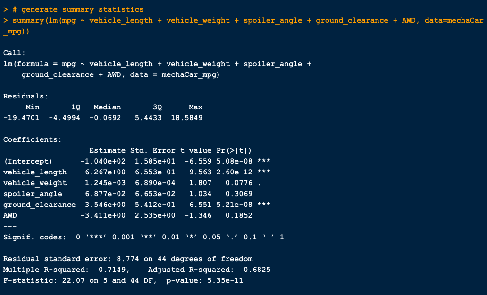
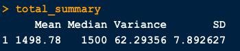
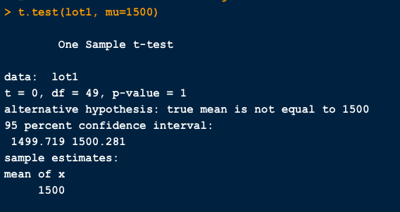
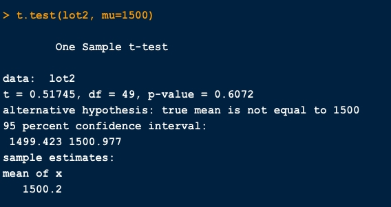
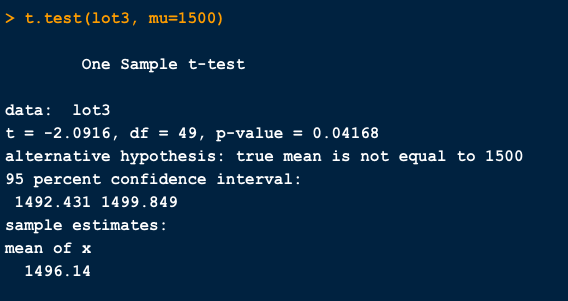

# MechaCar Statistical Analysis
## Overview
The purpose of this project was to conduct a series of statistical analyses on data sets provided for a car manufacturing company, MechaCar. Additionally, a hypothetical description of an analysis that could be done to compare the company against other car manufacturers was detailed.

## Results
### Linear Regression to Predict MPG

- The variables that provided a non-random amount of variance to the mpg values in the dataset are the `vehicle length` and `ground clearance` (as well as the intercept).
- The slope of the linear model is not considered to be zero because the p-value is less than 0.05 (5.35e-11), which is statistically significant. Therefore, we have sufficient evidence to reject the null hypothesis.
- Yes, this linear model predicts the mpg of the MechaCar prototypes effectively as the r-squared value is close to 1, at 0.7149 showing a strong correlation between the independent variables and mpg.  
 

### Summary Statistics on Suspension Coils

#### Manufacturing lots in total**

#### Each manufacturing lot individually**

Using the 'Manufacturing lots in total' and 'Each manufacturing lot individually' dataframes shown above, we can answer the following question:

The design specifications for the MechaCar suspension coils dictate that the variance of the suspension coils must not exceed 100 pounds per square inch. Does the current manufacturing data meet this design specification for all manufacturing lots in total and each lot individually? Why or why not?

Based on the summary output, we can see that the MechaCar suspension coils do not exceed a variance of 100 PSI when grouping all lots as a total. The total_summay dataframe, includes all points in the population and as such shows that the population mean is roughly 1499.5 PSI. When we look at the PSI variance in this dataframe, we see that there is approximately a 76.2 PSI variance grouping all three lots together. However, when we look at the lots individually, it appears as though lot 3, has a PSI variance that is much greater than the specified 100 pounds per square inch. The disparity in these results stems from the fact that lots 1 and 2 have very small variances from that the PSI of the cars manufactured in these lots is very close to 1499.5 and are able to compensate for the very large variance of lot 3. Only by looking at manufacturing lots individually are we able to see that lot 3's variance is much larger than that of its counterparts (about 220 PSI) indicating poor manufacturing standards from that lot. In short, the data tells us that as a whole MechaCars does meet PSI design specs but when it is broken down by lots, only the vehicles manufactured in lots 1 and 2 reliably meet the specifications while lot 3 does not.

### T-Tests on Suspension Coils
**Across all manufacturing lots**

- According to the results of the t-test on the suspension coils, the mean PSI across all manufacturing lots is 1499.531 PSI, with a p-value of 0.5117. The p-value is much higher than the 0.05 statistical significance level and the PSI is therefore, found to be **not statistically different** from the population mean of 1,500 PSI. We can conclude that we failed to reject the null hypothesis. 

**Each manufacturing lot individually**

- Lot1: The mean is 1500.018 PSI, with a p-value of 0.9048. The p-value is much higher than the 0.05 statistical significance level and the PSI is therefore, found to be **not statistically different** from the population mean. We can conclude that we failed to reject the null hypothesis. 

- Lot2: The mean is 1499.571 PSI, with a p-value of 0.3451. The p-value is much higher than the 0.05 statistical significance level and the PSI is therefore, found to be **not statistically different** from the population mean. We can conclude that we failed to reject the null hypothesis. 

- Lot 3: The mean is 1499.004 PSI, with a p-value of 0.637. The p-value is much higher than the 0.05 statistical significance level and the PSI is therefore, found to be **not statistically different** from the population mean. We can conclude that we failed to reject the null hypothesis.
 

## Study Design: MechaCar vs Competition
- Cost, city or highway fuel efficiency, horse power are the main three factors would be of interest to a consumer. In order to compare the MechaCar vehicles with other competitions, I would use cost, city or highway fuel efficiency, horse power to perform analysis between MechaCar vs Competitions. 
- The null hypothesis I wil use is assuming the MechaCar assuming there is no difference between MechaCar and competition for the vehicles performance in the same cost range. The alternative hypothesis is there is material difference between MechaCar and competition for the vehicle's performance comparing to price.
- I will use analysis of variance (ANOVA) test, which is used to compare the means of a continuous numerical variable across a number of factors.
- The required data would be sufficient cost, city or highway fuel efficiency, horse power data for vehicles from other competitions. 
